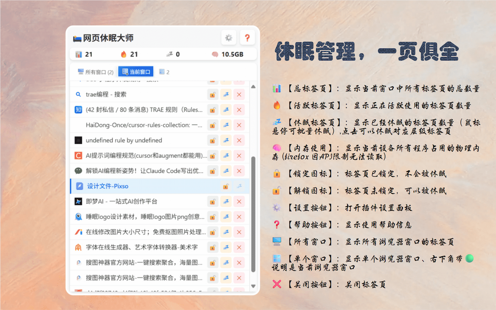

# 网页休眠大师 (Tab Hibernator)

一个基于 WXT 框架开发的浏览器插件，可以自动休眠不活跃的标签页以节省内存和CPU资源。

## 功能特性

- 🛌 **自动休眠**：自动检测并休眠不活跃的标签页
- ⏰ **可配置延迟**：自定义标签页休眠的时间延迟（默认不开启）
- 🎯 **智能过滤**：自动排除活动标签页、固定标签页、正在播放音频的标签页
- 🔒 **标签页锁定**：支持锁定重要标签页，防止被意外休眠
- 📝 **白名单支持**：支持设置域名白名单，防止特定网站被休眠
- 📊 **实时统计**：显示标签页统计信息（总数、活动、休眠）
- 🎛️ **手动控制**：支持手动休眠所有非活动标签页

### 插件主页

## 安装方法

### 🏪 应用商店安装（推荐）

- **Chrome Web Store**: 等待审核通过后，会在Chrome Web Store发布
- **Microsoft Edge Add-ons**: 等待审核通过后，会在Microsoft Edge Add-ons发布
- **Firefox Add-ons**: 等待审核通过后，会在Firefox Add-ons发布

### 🛠️ 开发者安装

#### Chrome/Edge/Firefox 浏览器

1. 下载 release 【[最新版本](https://github.com/guicaiyue/tab-hibernator/releases/latest)】 对应浏览器压缩包
2. 打开浏览器的扩展管理页面：
   - Chrome: `chrome://extensions/`
   - Edge: `edge://extensions/`
   - Firefox: `about:debugging#/runtime/this-firefox`

3. 开启「开发者模式」

4. 点击「加载已解压的扩展程序」

5. 选择下载的压缩包

6. 插件安装完成后，会在浏览器工具栏显示一个图标

## 使用说明

### 图标说明

- 🛌 **插件图标**：浏览器工具栏中的主图标，点击打开控制面板
- 📊 **总标签页**：显示当前窗口中所有标签页的总数量
- 🔥 **活跃标签页**：显示正在活跃使用的标签页数量
- 💤 **休眠标签页**：显示已经休眠的标签页数量（鼠标悬停可批量休眠）,点击可以休眠对应层级标签页
- 🧠 **内存使用**：显示当前设备所有程序占用的物理内存 (firefox 因API限制无法读取)
- 🔒 **锁定图标**：标签页已锁定，不会被休眠
- 🔓 **解锁图标**：标签页未锁定，可以被休眠
- ⚙️ **设置按钮**：打开插件设置面板
- ❓ **帮助按钮**：显示使用帮助信息
- 🖥️ **所有窗口**：显示所有浏览器窗口的标签页
- 🪟 **单个窗口**：显示单个浏览器窗口、右下角带🟢说明是当前浏览器窗口
- ❌ **关闭按钮**：关闭标签页

### 基本使用

1. 点击浏览器工具栏中的插件图标打开控制面板
2. 插件会自动开始监控标签页活动
3. 超过设定时间未活动的标签页将自动休眠

### 设置配置

在插件弹窗中可以配置：

- **休眠延迟时间**：设置标签页多长时间未活动后进入休眠（单位：分钟）
- **白名单域名**：添加不希望被休眠的网站域名，每行一个

### 手动操作

- **立即休眠**：点击 💤 按钮可立即休眠所有符合条件的标签页
- **标签页锁定**：在标签页列表中点击锁定图标（🔓/🔒）可锁定/解锁标签页，被锁定的标签页不会被自动或手动休眠
- **单个标签页操作**：在标签页列表中可对单个标签页进行休眠、锁定、关闭等操作

## ⭐ Star History
觉得不错，可以给我个star吗~😄

## 许可证

本项目采用 [Creative Commons Attribution-NonCommercial-ShareAlike 4.0 International License](https://creativecommons.org/licenses/by-nc-sa/4.0/) 许可证。

### 许可证说明

- ✅ **允许**：分享、修改、基于本项目创建衍生作品
- ❌ **禁止**：商业使用
- 📝 **要求**：署名原作者，衍生作品需使用相同许可证

### 使用条款

- **署名（Attribution）**：使用时必须注明原作者
- **非商业性使用（NonCommercial）**：不得用于商业目的
- **相同方式共享（ShareAlike）**：基于本项目的衍生作品必须使用相同的许可证

如需商业使用，请联系作者获得授权。